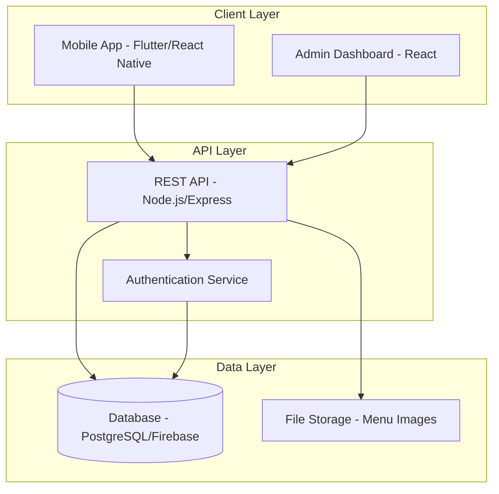

# Array Eats - Design Document

## Overview

Array Eats is a mobile-first application with a web-based admin dashboard. The system architecture follows a client-server model with a RESTful API backend, mobile application frontend, and web dashboard for administration. The design prioritizes security, simplicity, and real-time collaboration for group ordering.

## Architecture

### High-Level Architecture



### Technology Stack

- **Mobile App**: Flutter or React Native (cross-platform iOS/Android)
- **Backend API**: Node.js with Express.js
- **Database**: PostgreSQL (primary choice) or Firebase Firestore
- **Authentication**: Firebase Auth with email domain restriction
- **File Storage**: Firebase Storage or AWS S3 for menu images
- **Admin Dashboard**: React with Material-UI or Ant Design
- **Hosting**: AWS or Firebase Hosting

## Components and Interfaces

### 1. Authentication Module

**Purpose**: Manage user authentication and authorization with company email restriction.

**Components**:
- `AuthService`: Handles login, registration, and session management
- `EmailVerificationService`: Sends and validates verification codes
- `SessionManager`: Manages user sessions and tokens

**Key Interfaces**:

```typescript
interface AuthService {
  register(email: string, password: string): Promise<AuthResult>
  login(email: string, password: string): Promise<AuthResult>
  verifyEmail(code: string): Promise<boolean>
  logout(): Promise<void>
  validateEmailDomain(email: string): boolean
}

interface AuthResult {
  success: boolean
  token?: string
  user?: User
  error?: string
}

interface User {
  id: string
  email: string
  name: string
  role: 'employee' | 'admin'
  isVerified: boolean
  createdAt: Date
}
```

**Security Considerations**:
- Email domain validation (@array.com only)
- JWT tokens with expiration
- Secure password hashing (bcrypt)
- Rate limiting on authentication endpoints

### 2. Voting Module

**Purpose**: Enable daily restaurant voting with one vote per employee.

**Components**:
- `VotingService`: Manages voting logic and vote counting
- `RestaurantService`: Handles restaurant data and availability
- `VotingPeriodManager`: Controls voting windows and deadlines

**Key Interfaces**:

```typescript
interface VotingService {
  getAvailableRestaurants(date: Date): Promise<Restaurant[]>
  castVote(userId: string, restaurantId: string): Promise<VoteResult>
  getVotingResults(date: Date): Promise<VotingResults>
  hasUserVoted(userId: string, date: Date): Promise<boolean>
  determineWinner(date: Date): Promise<Restaurant>
}

interface Restaurant {
  id: string
  name: string
  cuisine: string
  imageUrl?: string
  isActive: boolean
  menu?: MenuItem[]
}

interface VoteResult {
  success: boolean
  message: string
  currentVoteCount?: number
}

interface VotingResults {
  date: Date
  restaurants: Array<{
    restaurant: Restaurant
    voteCount: number
  }>
  winner?: Restaurant
  isComplete: boolean
}
```

**Business Rules**:
- One vote per employee per voting period
- Voting period configurable by admin (default: 9 AM - 11 AM)
- Winner determined by highest vote count
- Tie-breaking: earliest restaurant added wins

### 3. Ordering Module

**Purpose**: Allow employees to place orders from the winning restaurant.

**Components**:
- `OrderService`: Manages individual and group orders
- `MenuService`: Handles menu items and customization
- `OrderAggregator`: Compiles group orders for export

**Key Interfaces**:

```typescript
interface OrderService {
  getMenu(restaurantId: string): Promise<MenuItem[]>
  createOrder(userId: string, order: OrderRequest): Promise<Order>
  getGroupOrder(date: Date): Promise<GroupOrder>
  updateOrder(orderId: string, updates: Partial<OrderRequest>): Promise<Order>
  cancelOrder(orderId: string): Promise<boolean>
}

interface MenuItem {
  id: string
  name: string
  description: string
  price: number
  category: string
  imageUrl?: string
  isAvailable: boolean
}

interface OrderRequest {
  restaurantId: string
  items: Array<{
    menuItemId: string
    quantity: number
    notes?: string
  }>
}

interface Order {
  id: string
  userId: string
  userName: string
  restaurantId: string
  items: OrderItem[]
  totalAmount: number
  status: 'pending' | 'confirmed' | 'cancelled'
  createdAt: Date
}

interface OrderItem {
  menuItem: MenuItem
  quantity: number
  notes?: string
  subtotal: number
}

interface GroupOrder {
  date: Date
  restaurant: Restaurant
  orders: Order[]
  totalOrders: number
  totalAmount: number
}
```

### 4. Admin Module

**Purpose**: Provide administrative controls for restaurant and menu management.

**Components**:
- `AdminService`: Core admin operations
- `RestaurantManager`: CRUD operations for restaurants
- `MenuManager`: Menu upload and management
- `ReportGenerator`: Export order summaries

**Key Interfaces**:

```typescript
interface AdminService {
  addRestaurant(restaurant: RestaurantInput): Promise<Restaurant>
  updateRestaurant(id: string, updates: Partial<RestaurantInput>): Promise<Restaurant>
  deleteRestaurant(id: string): Promise<boolean>
  uploadMenu(restaurantId: string, menu: MenuItem[]): Promise<boolean>
  setDailyRestaurants(date: Date, restaurantIds: string[]): Promise<boolean>
  exportOrders(date: Date): Promise<OrderExport>
}

interface RestaurantInput {
  name: string
  cuisine: string
  imageUrl?: string
  isActive: boolean
}

interface OrderExport {
  date: Date
  restaurant: Restaurant
  orders: Array<{
    employeeName: string
    items: Array<{
      itemName: string
      quantity: number
      notes?: string
    }>
  }>
  summary: {
    totalOrders: number
    itemBreakdown: Map<string, number>
  }
}
```

## Data Models

### Database Schema

**Users Table**
```sql
CREATE TABLE users (
  id UUID PRIMARY KEY DEFAULT gen_random_uuid(),
  email VARCHAR(255) UNIQUE NOT NULL,
  password_hash VARCHAR(255) NOT NULL,
  name VARCHAR(255) NOT NULL,
  role VARCHAR(20) DEFAULT 'employee',
  is_verified BOOLEAN DEFAULT FALSE,
  created_at TIMESTAMP DEFAULT CURRENT_TIMESTAMP,
  updated_at TIMESTAMP DEFAULT CURRENT_TIMESTAMP
);
```

**Restaurants Table**
```sql
CREATE TABLE restaurants (
  id UUID PRIMARY KEY DEFAULT gen_random_uuid(),
  name VARCHAR(255) NOT NULL,
  cuisine VARCHAR(100),
  image_url TEXT,
  is_active BOOLEAN DEFAULT TRUE,
  created_at TIMESTAMP DEFAULT CURRENT_TIMESTAMP,
  updated_at TIMESTAMP DEFAULT CURRENT_TIMESTAMP
);
```

**Menu Items Table**
```sql
CREATE TABLE menu_items (
  id UUID PRIMARY KEY DEFAULT gen_random_uuid(),
  restaurant_id UUID REFERENCES restaurants(id) ON DELETE CASCADE,
  name VARCHAR(255) NOT NULL,
  description TEXT,
  price DECIMAL(10, 2) NOT NULL,
  category VARCHAR(100),
  image_url TEXT,
  is_available BOOLEAN DEFAULT TRUE,
  created_at TIMESTAMP DEFAULT CURRENT_TIMESTAMP
);
```

**Voting Periods Table**
```sql
CREATE TABLE voting_periods (
  id UUID PRIMARY KEY DEFAULT gen_random_uuid(),
  date DATE UNIQUE NOT NULL,
  start_time TIME NOT NULL,
  end_time TIME NOT NULL,
  winner_restaurant_id UUID REFERENCES restaurants(id),
  is_complete BOOLEAN DEFAULT FALSE,
  created_at TIMESTAMP DEFAULT CURRENT_TIMESTAMP
);
```

**Votes Table**
```sql
CREATE TABLE votes (
  id UUID PRIMARY KEY DEFAULT gen_random_uuid(),
  user_id UUID REFERENCES users(id) ON DELETE CASCADE,
  restaurant_id UUID REFERENCES restaurants(id) ON DELETE CASCADE,
  voting_period_id UUID REFERENCES voting_periods(id) ON DELETE CASCADE,
  created_at TIMESTAMP DEFAULT CURRENT_TIMESTAMP,
  UNIQUE(user_id, voting_period_id)
);
```

**Orders Table**
```sql
CREATE TABLE orders (
  id UUID PRIMARY KEY DEFAULT gen_random_uuid(),
  user_id UUID REFERENCES users(id) ON DELETE CASCADE,
  restaurant_id UUID REFERENCES restaurants(id) ON DELETE CASCADE,
  voting_period_id UUID REFERENCES voting_periods(id) ON DELETE CASCADE,
  status VARCHAR(20) DEFAULT 'pending',
  total_amount DECIMAL(10, 2) NOT NULL,
  created_at TIMESTAMP DEFAULT CURRENT_TIMESTAMP,
  updated_at TIMESTAMP DEFAULT CURRENT_TIMESTAMP
);
```

**Order Items Table**
```sql
CREATE TABLE order_items (
  id UUID PRIMARY KEY DEFAULT gen_random_uuid(),
  order_id UUID REFERENCES orders(id) ON DELETE CASCADE,
  menu_item_id UUID REFERENCES menu_items(id) ON DELETE CASCADE,
  quantity INTEGER NOT NULL,
  notes TEXT,
  subtotal DECIMAL(10, 2) NOT NULL,
  created_at TIMESTAMP DEFAULT CURRENT_TIMESTAMP
);
```

## Error Handling

### Error Categories

1. **Authentication Errors**
   - Invalid email domain
   - Invalid credentials
   - Unverified email
   - Expired session

2. **Voting Errors**
   - Voting period closed
   - Already voted
   - Invalid restaurant selection

3. **Ordering Errors**
   - No winner determined
   - Menu item unavailable
   - Invalid order data

4. **Admin Errors**
   - Unauthorized access
   - Invalid restaurant data
   - Menu upload failure

### Error Response Format

```typescript
interface ErrorResponse {
  success: false
  error: {
    code: string
    message: string
    details?: any
  }
  timestamp: Date
}
```

### Error Handling Strategy

- **Client-side**: Display user-friendly error messages with actionable guidance
- **API-side**: Log errors with context, return appropriate HTTP status codes
- **Validation**: Validate all inputs at both client and server levels
- **Retry Logic**: Implement exponential backoff for transient failures
- **Fallback**: Graceful degradation when non-critical features fail

## Testing Strategy

### Unit Testing
- Test individual services and utilities
- Mock external dependencies (database, authentication)
- Focus on business logic validation
- Target: 80% code coverage

### Integration Testing
- Test API endpoints with real database (test environment)
- Verify authentication flows
- Test voting and ordering workflows
- Validate data persistence

### End-to-End Testing
- Test complete user journeys (login → vote → order)
- Test admin workflows (add restaurant → set daily options → export orders)
- Use automated testing tools (Cypress for web, Detox for mobile)

### Manual Testing
- UI/UX validation on multiple devices
- Cross-browser testing for admin dashboard
- Performance testing with concurrent users
- Security testing (penetration testing for authentication)

### Test Data Strategy
- Seed database with sample restaurants and menus
- Create test users with different roles
- Simulate voting periods and orders
- Reset test environment between test runs

## Performance Considerations

- **Caching**: Cache restaurant and menu data (Redis)
- **Database Indexing**: Index frequently queried fields (user_id, date, restaurant_id)
- **Pagination**: Implement pagination for order history and restaurant lists
- **Image Optimization**: Compress and resize menu images
- **API Rate Limiting**: Prevent abuse with rate limiting (100 requests/minute per user)

## Security Measures

- HTTPS only for all communications
- JWT tokens with short expiration (1 hour)
- Refresh token mechanism for session extension
- SQL injection prevention (parameterized queries)
- XSS protection (input sanitization)
- CSRF protection for state-changing operations
- Role-based access control (RBAC) for admin features
